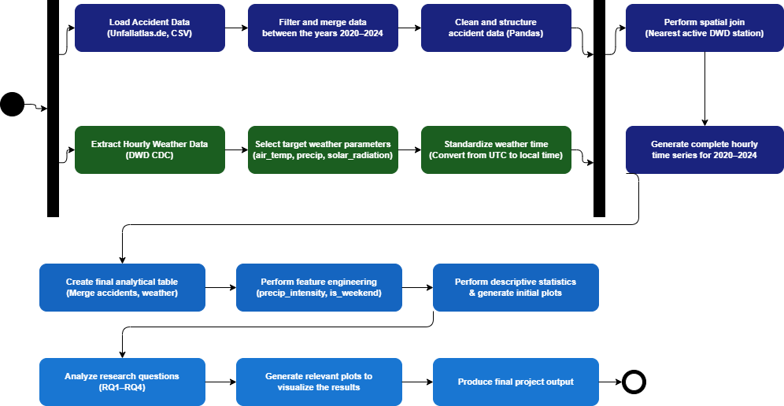

# Requirements

## Project: Weather-Driven Traffic Accident Risk in Germany (2016–2024)

The goal of this project is to combine German traffic accident records (Unfallatlas) with hourly
weather observations from the DWD Climate Data Center to investigate how weather conditions
relate to accident frequency.

---

## 1. Functional Requirements

The workflow takes two datasets — accident records and hourly weather data — prepares them
separately, joins them by location and time, and produces statistical results and visualisations
that answer the research questions below.

### Research Questions

- **RQ1 — Weather and Accident Severity:** How do varying intensities of precipitation and freezing temperatures impact traffic accident frequency and severity, and do they shift the mix of accident types (e.g. loss-of-control accidents vs. collisions)?
- **RQ2 — Summer Sun Threat:** To what extent do summer weather factors — specifically solar radiation (sun glare) and extreme heat — predict commuter-hour accident rates compared to rainy conditions?
- **RQ3 — Spatial Sensitivity:** Which German federal states exhibit the strongest sensitivity of accident patterns to changing weather conditions, and how does this differ between city states and territorial states?
- **RQ4 — Temporal Evolution:** How have traffic safety patterns evolved under varying weather conditions in Germany between 2016 and 2024, and has the relative risk of weather-related accidents declined over that period?

*Note on RQ1:* The original idea was to compare Autobahns against rural roads. The published
Unfallatlas data does not contain a road-class attribute, so the question was refined to
compare accident severity categories and accident types instead, which the data does support.

### Abstract Workflow (UML Activity Diagram)

The diagram shows the year range 2020–2024; the analysed range is configurable in the
workflow configuration and is set to 2016–2024 so that RQ4 can look at a longer trend.

---

## 2. Non-Functional Requirements

1. The project shall run without problems given that all required dependencies are installed properly.
2. The total execution time of the whole project (from reading the raw data to outputting the final results) shall be completed under a reasonable time on a standard laptop.
3. The whole project shall be idempotent — running it multiple times should produce identical output results and visualisations.
4. The project shall support adding more data (additional years or weather parameters) without requiring major code changes.
5. Each step of the workflow shall be a standalone script with clear inputs and outputs, so that individual steps can be re-run independently.
6. Errors (e.g. missing files, download failures, invalid data) shall produce a clear message rather than silently failing.

---

## 3. Abstract Workflow Component Table

| **Abstract Workflow Node (Operation)** | **Input(s)** | **Output(s)** | **Implementation** | **Runnable locally?** |
|---|---|---|---|---|
| **Load accident data** | Raw yearly files in `data/raw_accidents/` (CSV/TXT, already downloaded) | Per-year accident dataframes | Own implementation — `pandas.read_csv` with per-year separator and encoding | yes |
| **Filter & merge accident data (2016–2024)** | Per-year accident dataframes | Single merged accident CSV | Own implementation — `pandas.concat` + year filter | yes |
| **Clean & structure accident data** | Merged accident CSV | Cleaned accident CSV (typed columns, valid coordinates only) | Own implementation — pandas (drop nulls, cast types, rename columns) | yes |
| **Extract hourly weather data (DWD CDC)** | Year range, parameters, stations per state | Raw hourly weather files + station metadata | Own implementation — small downloader using [`requests`](https://requests.readthedocs.io/) against the [DWD open data server](https://opendata.dwd.de/climate_environment/CDC/) (we first tried the `wetterdienst` library, but a plain downloader turned out simpler and with fewer heavy dependencies) | yes (needs internet) |
| **Select target weather parameters** | Raw weather files | Filtered dataframe (`air_temp`, `precip`, `solar_radiation` only) | Own implementation — parameter selection while parsing the DWD product files | yes |
| **Standardize weather time (UTC → local)** | Filtered weather dataframe with UTC timestamps | Weather dataframe in CET/CEST local time | Own implementation — `pandas.tz_convert('Europe/Berlin')` | yes |
| **Perform spatial join (nearest active DWD station)** | Cleaned accident table, DWD station metadata (lat/lon) | Accident table with `station_id` added | Own implementation — `scipy.spatial.cKDTree` on station coordinates | yes |
| **Generate complete hourly time series (2016–2024)** | Cleaned weather dataframe, station list | Gap-free hourly weather series per station | Own implementation — `pandas.date_range` + `reindex` | yes |
| **Create final analytical table** | Accident table with `station_id`, hourly weather series | Merged analytical table (CSV) | Own implementation — `pandas.merge` on `station_id` + date/hour | yes |
| **Perform feature engineering** | Merged analytical table | Table with `precip_intensity`, `is_frost`, `is_weekend`, commuter-hour flag | Own implementation — `pd.cut` for intensity bins, `dt.weekday` for weekend flag | yes |
| **Perform descriptive statistics & generate initial plots** | Feature-enriched table | Summary statistics CSV + exploratory PNG plots | Own implementation — `pandas.groupby` + `describe`, `matplotlib` / `seaborn` | yes |
| **Analyze research questions (RQ1–RQ4)** | Feature-enriched table | Result tables (CSV) per RQ | Own implementation — `pandas`, `scipy.stats` (risk ratios, chi-square, correlation) | yes |
| **Generate relevant plots to visualize the results** | Result tables (CSV) per RQ | Figures (PNG) per RQ | Own implementation — `matplotlib` / `seaborn` | yes |
| **Produce final project output** | Result tables, figures, summary statistics | Final report (Markdown) | Own implementation — assembles all outputs into a structured report | yes |
